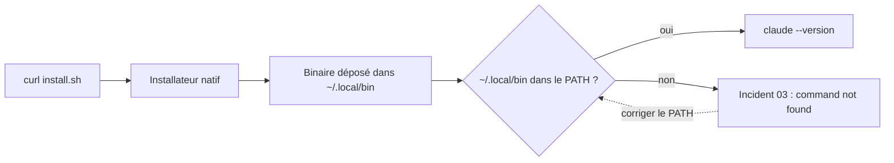

Cette note décrit l'installation de Claude Code (CLI Anthropic) sur Linux (x64/ARM64), ainsi que la résolution des problèmes courants (notamment l'erreur de commande non trouvée) et l'activation du mode autonome.

## Prérequis système {#s-prerequis-systeme}

Installer `curl` (utilisé par l'installateur) :

```bash
# Debian / Ubuntu
sudo apt update && sudo apt install -y curl

# Fedora
sudo dnf install curl

# Arch
sudo pacman -S curl
```

Vérifier l'architecture avec `uname -m` : la valeur attendue est `x86_64` ou `aarch64`. L'installateur natif ne dépend pas de Node.js ; seule l'installation via npm le requiert (18+).

## Installation {#s-installation}

L'installateur natif télécharge le binaire correspondant à l'architecture et le place dans `~/.local/bin` :

```bash
curl -fsSL https://claude.ai/install.sh | bash
```

Le parcours d'installation tient en quatre étapes ; la seule bifurcation est la présence de `~/.local/bin` dans le `PATH` :



> Si `~/.local/bin` n'est pas dans le `PATH`, la commande `claude` ne sera pas trouvée après l'installation. Voir l'incident connu ci-dessous.

## Incident connu {#s-incident-connu}

Le binaire est présent mais le shell ne connaît pas son répertoire. Ajouter `~/.local/bin` au `PATH` de façon persistante :

```bash
echo 'export PATH="$HOME/.local/bin:$PATH"' >> ~/.bashrc
source ~/.bashrc
```

Vérifier ensuite avec `claude --version`. Sous zsh, remplacer `~/.bashrc` par `~/.zshrc`.

## Première exécution {#s-premiere-execution}

Depuis le répertoire d'un projet, lancer `claude`. La première exécution enchaîne trois étapes :

- choix du thème d'affichage (clair / sombre) ;
- connexion au compte Anthropic via le navigateur (un code de vérification s'affiche dans le terminal) ;
- autorisation d'accès au répertoire courant, mémorisée dans `~/.claude.json`.

## Mode autonome {#s-mode-autonome}

Par défaut, chaque commande et chaque écriture de fichier demande une confirmation. Le mode autonome les supprime :

```bash
claude --dangerously-skip-permissions
```

> **Réservé à un environnement isolé** (conteneur, machine virtuelle jetable, sans accès aux identifiants de production). Le mode autonome exécute sans confirmation tout ce que le modèle décide.

## Précautions {#s-precautions}

- Ne jamais lancer le mode autonome dans un répertoire contenant des secrets non versionnés.
- Travailler sur une branche dédiée et relire le diff avant toute fusion.
- Limiter la session avec `--max-turns` lorsque la tâche est bornée.

## Références {#s-references}

- Documentation officielle Claude Code — installation et prise en main.
- Fiche interne « Mode autonome — Bonnes pratiques » (relation « complète »).
- Incident « PATH Linux » (relation « corrige »).

## Purge {#s-purge}

Pour retirer complètement l'outil et sa configuration :

```bash
rm -rf ~/.local/bin/claude ~/.claude ~/.claude.json
```

--- OPERATIONNEL ---
## Préparer la machine {#o-preparer-la-machine}

- [ ] Vérifier `uname -m` → `x86_64` ou `aarch64`.
- [ ] Installer `curl` si absent.

## Installer {#o-installer}

```bash
curl -fsSL https://claude.ai/install.sh | bash
```

- [ ] Attendre la fin du téléchargement du binaire.
- [ ] Ouvrir un nouveau terminal.

## Corriger le PATH si besoin {#o-corriger-le-path}

- [ ] Si `claude: command not found` : ajouter `~/.local/bin` au PATH dans `~/.bashrc`.
- [ ] Recharger le shell puis `claude --version`.

## Authentifier {#o-authentifier}

- [ ] Lancer `claude` dans le projet.
- [ ] Se connecter dans le navigateur avec le compte Anthropic.
- [ ] Autoriser le répertoire courant.

## Mode autonome {#o-mode-autonome}

> **Point de vigilance** — n'activer le mode autonome que dans un conteneur ou une VM jetable.

- [ ] Créer une branche dédiée.
- [ ] Lancer `claude --dangerously-skip-permissions`.
- [ ] Relire le diff complet avant fusion.
